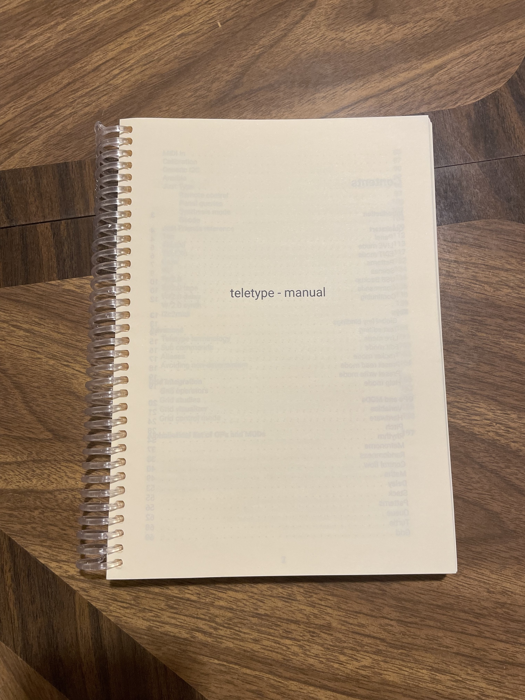
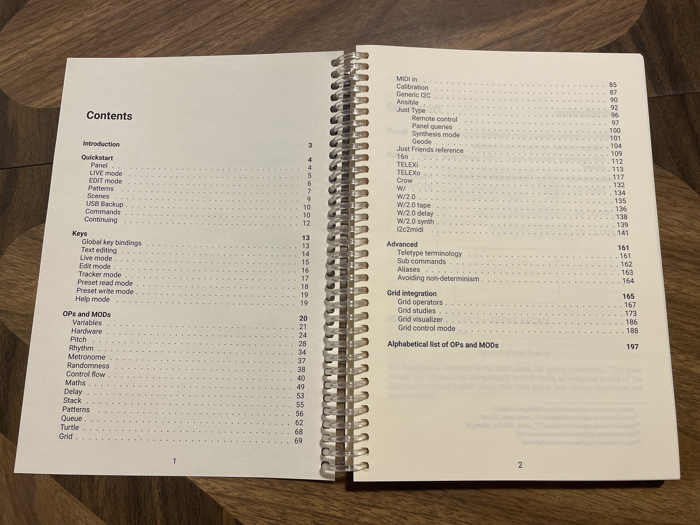
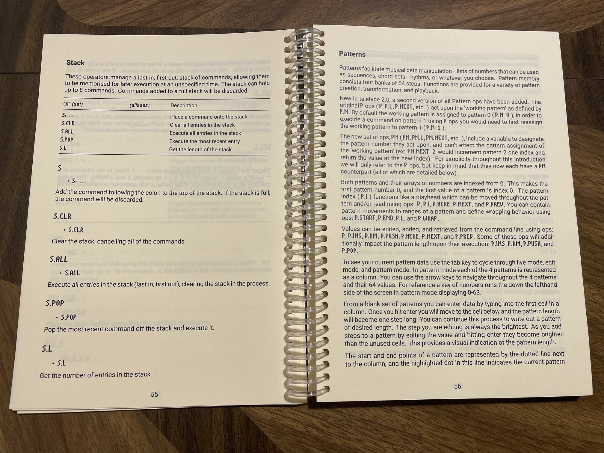
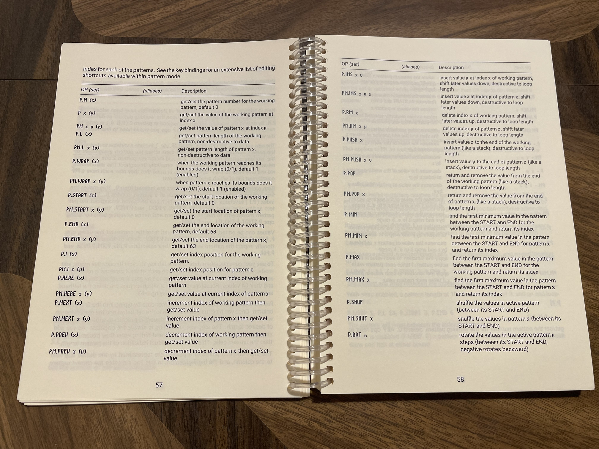

# changes from upstream
This branch is for modifying the documenation building script (./utils/docs.py), adding new content, and changing formatting for the teletype manual, to make a PDF for printing on A5 paper.

The printed result:
- 
- 
- 
- 

There are some rough edges with the formatting, and I have not fully proofread the manual. It is possible there are sections that are completely borked, although I haven't come across any.

## approximate list of changes
- I've set the font to a slightly modified version of the ["liquid" font from the norns repo](https://github.com/monome/norns/blob/main/resources/liquid.ttf)
    - adjusted font spacing and added a minus character
    - legibility is worse than the default "Roboto" monospaced font, but this change was for form, not function
- the changelog was removed
- the [Just Type documentation](https://github.com/whimsicalraps/Just-Friends/blob/main/Just-Type.md) was added to the Just Friends section
- I've added some pages to the "advanced" section of the manual from the [teletype wiki](https://github.com/scanner-darkly/teletype/wiki), like the grid integration and grid studies
	- the pages are added in `docs.py`
- I've commented out i2c devices from `docs.py` that I don't want included in the manual
- removed the `OP (set)` column from the OP reference pages, and merged it with the regular `OP` column. If an OP has an optional argument that can be passed to set, that argument is placed inside parentheses, like in the column header
    - ex. `SCRIPT.POL x (p)` means `SCRIPT.POL x` will get script `x`'s polarity, and `SCRIPT.POL x p` will set script `x`'s polarity to `p`
- I've gotten a5 ruled paper PDFs from https://ruledpaper.net which are in the repo in `./docs/notes-pages`
    - these are not added programmatically, but manually after the PDF is built (to the end of the PDF)

## how to build
Here are the steps that I used on a fresh Debian VM to build the PDF:
- `sudo apt install python3`
- `sudo apt install python3.11-venv`
- `sudo apt install pandoc`
- `sudo apt install texlive-latex-extra`
- `sudo apt install texlive-xetex`
- `git clone -b custom-pdf https://github.com/evannjohnson/teletype-ev`
- `python3 -m venv ./.venv`
- `source .venv/bin/activate`
- `pip install -r utils/requirements.pip`
- modify `utils/docs.py` to include/exclude sections relevant to you
    - comment out (or uncomment) lines in the "OPS_SECTIONS" array (line 34)
    - to exclude the grid integration/grid studies section, comment out lines 148-165
        - (the lines `advanced += Path(DOCS_DIR / doc).read_text() + "\n\n"` and `advanced += Path(DOCS_DIR / "teletype-wiki/GRID-CONTROL-MODE.md").read_text() + "\n\n")
- `cd docs`
- `../utils/docs.py teletype-manual.pdf`
- the PDF should now be at `docs/teletype-manual.pdf`

## how I printed
I printed via [Doxzoo](https://doxzoo.com), with the settings:
- Paper size: A5
- Printed sides: Double sided
- Print in: Black & white
- Paper colour: Cream
- Paper finish: Matt (coloured)
- Paper weight: 80 gsm
- Binding position: Left long edge
- Coil colour: Clear
- Outer front cover: None
- Front cover: None
- Back cover: None
- Outer back cover: None
- No. of tabs: 0
- Corners: Square

# teletype

monome eurorack module

http://monome.org/docs/teletype

## Directories

- `src`: source code for the teletype algorithm
- `module`: `main.c` and additional code for the Eurorack module (e.g. IO and UI)
- `tests`: algorithm tests
- `simulator`: a (very) simple teletype command parser and simulator
- `docs`: files used to generate the teletype manual

## Building

See the [libavr32 repo][libavr32] for more detailed instructions. You will also need `ragel` installed and on the path, see below.

Alternatively, if you have Docker installed, you can quickly get
building with a [Docker image](https://github.com/Dewb/monome-build)
that has all the dependencies set up:

```bash
git clone --recursive --config core.autocrlf=input https://github.com/monome/teletype
docker run --rm -it -v"$(pwd)/teletype":/target dewb/monome-build bash
make
```

The reasoning behind these options:

```
git
  --recursive                   # clone libavr32 and unity submodules
  --config core.autocrlf=input  # if on Windows, avoid adding CRLF line endings that can break compile scripts

docker
  --rm                          # delete the container after exiting it
  -it                           # keep stdin attached, allocate tty
  -v"$(pwd)/teletype":/target  # mount the ./teletype directory at /target inside the container
```

**Make sure that the `libavr32` submodule is correctly checked out**

```bash
cd module
make clean
make
./flash.sh
```

## Tests

To run the tests:

```bash
cd tests
make clean  # only needed if you've built the module code
make test
```

In the case of line ending issues `make test` may fail, in this case
`make tests && ./tests` might work better.

## Ragel

The [Ragel state machine compiler][ragel] is required to build the firmware. It needs to be installed and on the path:

```bash
brew install ragel  # Homebrew (OSX)
apt install ragel   # Debian / Ubuntu / WSL (Windows 10)
pacman -Sy ragel    # Arch Linux / MSYS2 (Windows)
```

Version 6.9 is known to work.

See section 6.3 in the Ragel manual for information on the `=>` scanner constructor used.

## Adding a new `OP` or `MOD` (a.k.a. `PRE`)

If you want to add a new `OP` or `MOD`, please create the relevant `tele_op_t` or `tele_mod_t` in the `src/ops` directory. You will then need to reference it in the following places:

- `src/ops/op.c`: add a reference to your struct to the relevant table, `tele_ops` or `tele_mods`. Ideally grouped with other ops from the same file.
- `src/ops/op_enum.h`: please run `python3 utils/op_enums.py` to generate this file.
- `src/match_token.rl`: add an entry to the Ragel list to match the token to the struct. Again, please try to keep the order in the list sensible.
- `module/config.mk`: add a reference to any added .c files in the CSRCS list.
- `tests/Makefile`: add a reference to any added .c files in /src, replacing ".c" with ".o", in the tests: recipe.
- `simulator/Makefile`: add a reference to any added .c files in /src, replacing ".c" with ".o", in the OBJS list.

There is a test that checks to see if the above have all been entered correctly. (See above to run tests.)

## Code Formatting

To format the code using `clang-format`, run `make format` in the project's root directory. This will _only_ format code that has not been commited, it will format _both_ staged and unstaged code.

To format all the code in this repo, run `make format-all`.

[libavr32]: https://github.com/monome/libavr32
[ragel]: http://www.colm.net/open-source/ragel/

## Documentation

In order to build the documentation you will need Python 3.6 or greater, [Pandoc][], as well as the Python libraries specified in the [`requirements.pip`][requirements.pip] file. In addition, to generate the PDF output you will also require [TexLive][], [TinyTeX][], or [MacTex][].

On macOS the dependencies aside from TinyTeX can be installed with `brew`.

```bash
brew install python3
brew install pandoc
cd utils
pip3 install -r requirements.pip
```

To install TinyTeX on macOS, as well as the `titlesec` package that pandoc needs, do the following.
```bash
curl -sL "https://yihui.org/tinytex/install-bin-unix.sh" | sh
tlmgr install titlesec
fmtutil-sys -all
```
As opposed to TeXLive or MacTeX, TinyTeX is "only" a 105MB install.
(Note: `fmtutil-sys` will produce copious output.)

On Linux I would suggest using [`virtualenv`][virtualenv] to install all the Python dependencies (including those in the [`requirements.pip`][requirements.pip] file), and to ensure that the `python3` binary is version 3.6 or greater instead of the default of your distro.

[virtualenv]: https://virtualenv.pypa.io/en/stable/

To generate the documentation:

```bash
cd docs
make               # build both teletype.pdf and teletype.html
make teletype.pdf  # build just teletype.pdf (requires TexLive or MacTex)
make teletype.html # build just teletype.html
```

[requirements.pip]: utils/requirements.pip
[Pandoc]: http://pandoc.org/
[TinyTeX]: https://yihui.org/tinytex/
[TexLive]: https://www.tug.org/texlive/
[MacTex]: https://www.tug.org/mactex/

## Making a Release

To create a `teletype.zip` file containing:

 - `teletype.hex`
 - `flash.sh`
 - `update_firmware.command`
 - `teletype.pdf`

Run `make release` in the project's root directory
